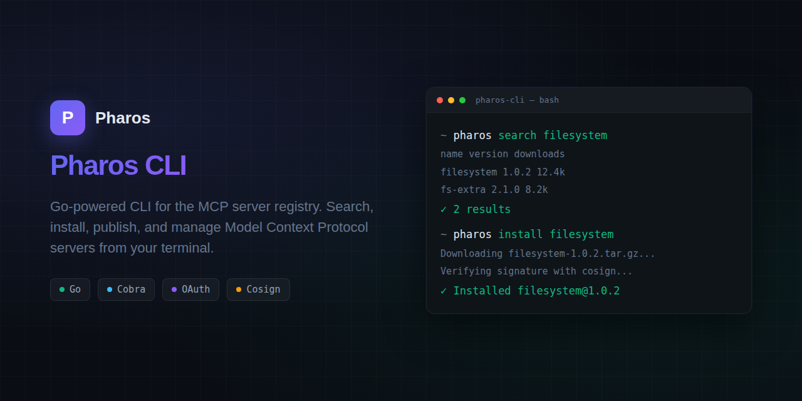

# Pharos CLI




A Go CLI tool for the [PHAROS](https://getpharos.dev) MCP server package registry.

## Install

```bash
go install github.com/Wpnx330/pharos-cli@latest
```

Or build from source:

```bash
go build -o pharos .
```

## Commands

```bash
# Discovery
pharos search <query>          # Search the registry
pharos info <name>             # Show package details

# Package lifecycle
pharos init                    # Scaffold a new pharos.json (interactive, includes dependency prompts)
pharos init --yes              # Non-interactive (use defaults)
pharos package [dir]           # Package a directory into a tarball (like npm pack)
pharos publish [dir]           # Package + upload + publish to the registry

# Local management
pharos install <name>          # Download and install a package (with recursive dependency resolution)
pharos install <name> --no-dep-config  # Install without writing MCP client configs for dependencies
pharos list                    # List locally installed packages
pharos lock                    # Resolve dependencies and write ./pharos.lock
pharos remove <name>           # Remove a locally installed package
pharos remove <name> --force   # Remove even if other packages depend on it

# Auth
pharos login                   # GitHub OAuth login (opens browser)
pharos whoami                  # Show current authenticated user

# OAuth configuration
pharos oauth configure <name>  # Configure OAuth for a published MCP server
pharos oauth configure <name> \ # With all options
  --auth-url <url> --client-id <id> --scopes <scopes> --pkce

# System
pharos config <key> [value]    # Get or set configuration
pharos health                  # Check registry health
pharos version                 # Print CLI version
```

## Flags

- `--json` — Output as JSON (search, info, health)
- `--limit` / `-n` — Number of search results (default: 10)
- `--page` / `-p` — Search page number
- `--version` / `-v` — Install a specific version
- `--global` / `-g` — Install system-wide
- `--token` / `-t` — Auth token for publishing
- `--dry-run` — Validate manifest without publishing
- `--yes` — Skip interactive prompts (init)
- `--no-dep-config` — Don't write MCP client configs for dependencies (install)
- `--force` — Remove a package even if other packages depend on it (remove)
- `--frozen` — Install strictly from lockfile; refuse if missing or mismatched (install)

## Configuration

Config is stored at `~/.pharos/config.json`:

```bash
pharos config registry https://getpharos.dev
pharos config token <your-token>
```

Credentials are stored at `~/.pharos/credentials.json` after `pharos login`.

## Manifest (pharos.json)

```json
{
  "name": "my-mcp-server",
  "version": "1.0.0",
  "description": "An MCP server for X",
  "license": "MIT",
  "transport": "stdio",
  "runtime": "python",
  "command": "python server.py",
  "capabilities": ["tools"],
  "homepage": "https://github.com/user/repo",
  "repository": "https://github.com/user/repo",
  "files": ["server.py", "lib/"]
}
```

### Manifest fields

| Field | Required | Description |
|-------|----------|-------------|
| `name` | yes | Package name (unscoped or `@scope/name`) |
| `version` | yes | Semantic version |
| `description` | no | Short description shown in search results |
| `license` | no | SPDX license identifier |
| `transport` | yes | `stdio`, `http-sse`, or `http` |
| `runtime` | no | Runtime hint: `npx`, `uvx`, `docker`, `binary`, `python` (auto-detected from command if omitted) |
| `command` | no | Explicit launch command (e.g. `python -m src.server`). Overrides runtime-based construction. Falls back to `bin` field for backwards compat |
| `entrypoint` | no | Alternative to `command` (Docker entrypoint) |
| `capabilities` | yes | MCP capability types: `tools`, `resources`, `prompts`, `logging` |
| `files` | no | Explicit file list to package (auto-detected if omitted). Directory entries (e.g. `"src/"`) are packed recursively |
| `homepage` | no | Homepage URL |
| `repository` | no | Repository URL |
| `dependencies` | no | Array of `{name, version}` — semver constraints for recursive install |

## Publishing

The `pharos publish` command runs a 4-phase flow automatically:

1. **Get user** — `GET /v1/auth/me` to determine your namespace
2. **Create package** — `POST /v1/packages` (creates the package row; 409 = already exists, OK)
3. **Upload** — `POST /v1/uploads` → PUT tarball bytes to presigned URL
4. **Publish** — `PUT /v1/packages/{name}` with version, manifest, blob reference, integrity hash

```bash
pharos publish ./my-mcp-server
```

You can also package separately:

```bash
pharos package ./my-mcp-server    # creates my-mcp-server-1.0.0.tgz
```

## Safe Config Writes

All MCP client config writes (install and remove) go through a safe write pattern:

1. **Write to temp file** — changes go to `<config>.pharos-tmp`, never the original directly
2. **Validate** — the temp file is read back and checked:
   - Non-empty (0 bytes = abort)
   - Parseable as the expected format (YAML for Hermes, JSON for others)
   - Size check: if the original was >200 bytes and the new file is <25% of it, abort (catches truncation/corruption)
3. **Atomic swap** — `rename` temp over original (atomic on most filesystems)
4. **Cleanup** — if any step fails, the temp file is deleted and the original is left untouched

This means a buggy write can never corrupt an existing config — the original is only replaced after the new version passes validation.

**Unknown key preservation**: For JSON-based clients (OpenCode, Cursor, Claude Desktop, Cline, Generic MCP), Pharos uses a map-based reader/writer that preserves all existing top-level keys. If your OpenCode config has `model`, `theme`, or `tab_size` settings, they survive Pharos installs and removes untouched.

### Supported client formats

| Client | Config path | Format |
|--------|------------|--------|
| Hermes Agent | `~/.hermes/config.yaml` | YAML (`mcp_servers:`) |
| Claude Desktop | `~/AppData/Roaming/Claude/claude_desktop_config.json` | JSON (`{"mcpServers": {}}`) |
| Cursor | `~/.cursor/mcp.json` | JSON (`{"mcpServers": {}}`) |
| Cline | `~/.../cline_mcp_settings.json` | JSON (`{"mcpServers": {}}`) |
| OpenCode | `~/.config/opencode/opencode.json` | JSON (`{"mcpServers": {}}`) |
| Generic MCP | `~/.config/mcp/mcp.json` | JSON (`{"mcpServers": {}}`) |

## Development

```bash
go test ./... -v -count=1
go vet ./...
go build .
```

## Dependency Resolution

The CLI supports recursive dependency resolution. When you install a package that declares
dependencies, the CLI resolves them to concrete versions and installs them automatically.

### Declaring dependencies in `pharos.json`

```json
{
  "name": "my-server",
  "version": "1.0.0",
  "transport": "stdio",
  "runtime": "python",
  "command": "python server.py",
  "dependencies": [
    {"name": "other-server", "version": ">=1.0.0"},
    {"name": "utils-lib", "version": "^2.0.0"}
  ]
}
```

### How it works

1. `pharos install <name>` installs the primary package first
2. If the manifest has a `dependencies` array, the CLI prints "Resolving dependencies..."
3. Each dependency is resolved recursively (transitive deps included)
4. Already-installed dependencies at the resolved version are skipped
5. Version conflicts are resolved by choosing the higher version
6. Circular dependencies are detected at **publish time** — the registry rejects the publish with an error. At install time, the CLI also detects cycles and skips them
7. Each installed dependency gets a client config entry + lockfile entry (unless `--no-dep-config` is passed)

### `pharos init` dependency prompts

During `pharos init`, after selecting a license, the CLI prompts for dependencies.
Enter each dependency in one of these formats:

| Input | Stored as |
|-------|-----------|
| `name` | `*` (any version) |
| `name@latest` | `latest` |
| `name>=0.1.0` | `>=0.1.0` |
| `name=0.1.0` | `=0.1.0` |
| `name<=0.1.0` | `<=0.1.0` |
| `name^1.0.0` | `^1.0.0` |

An empty line finishes dependency entry.

### `pharos lock`

```bash
pharos lock    # Resolve all deps in pharos.json, write ./pharos.lock
```

Resolves dependencies and writes a lockfile at `./pharos.lock` (per-project, like
`package-lock.json`). The lockfile records the concrete version, transport, and registry
URL for each resolved package.

### `pharos remove` dependency protection

```bash
pharos remove <name>           # Remove a package (blocked if other packages depend on it)
pharos remove <name> --force   # Remove even if other packages depend on it
```

When you try to remove a package that is a required dependency of another installed
package, the CLI blocks the removal and lists the dependent packages. Use `--force`
to override.

### Circular dependency detection at publish time

The registry rejects publishes that would create circular dependencies. If package A
depends on B and package B depends on A, publishing the second package will be rejected
with a `CIRCULAR_DEPENDENCY` error showing the cycle path. Forward references (dependencies
not yet in the registry) are allowed — the cycle is caught on the second publish.

### Version constraints

| Constraint | Meaning |
|------------|---------|
| `1.0.0` | Exact version |
| `>=1.0.0` | Minimum version |
| `^1.0.0` | Compatible (same major) |
| `~1.0.0` | Approximately (same minor) |
| `*` | Any version |

## Author

Built by [Chris Wykel](https://chriswykel.com) — reach me at chris@chriswykel.com.

## License

MIT
